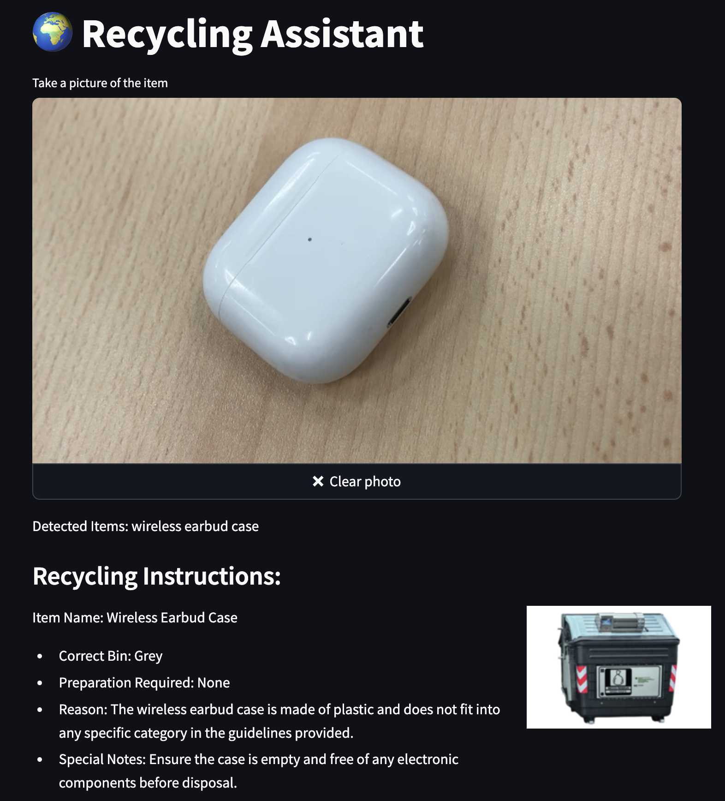

# 🌍 Traish (Recycling Assistant)

A smart web application that helps users properly sort and recycle items using computer vision and AI. The application provides detailed recycling instructions based on image analysis and local recycling guidelines.



## Demo

https://traish.streamlit.app/

## Features

- 📸 Image-based item recognition
- 🗑️ Detailed sorting instructions for each identified item
- 🎯 Bin color coding system
- 🔍 Nearby ecological sites finder
- 🤖 AI-powered waste classification
- 📋 Structured recycling guidelines

## Technologies Used

- **Frontend**: Streamlit
- **AI Services**:
  - Groq and llama for recycling instructions
  - Toolhouse for location-based services

## Prerequisites

- Python 3.8+
- Required API keys:
  - OpenAI API key
  - Groq API key
  - Toolhouse API key

## Installation

1. Clone the repository and install the dependencies:

```
cd traish 
pip install -r requirements.txt

```

2. Set up your environment variables in `.streamlit/secrets.toml`:

```
[api_keys]
groq = "your_groq_api_key"
openai = "your_openai_api_key"
toolhouse = "your_toolhouse_api_key"
```

## Usage 
1. Start the application:
```
streamlit run app.py
```
